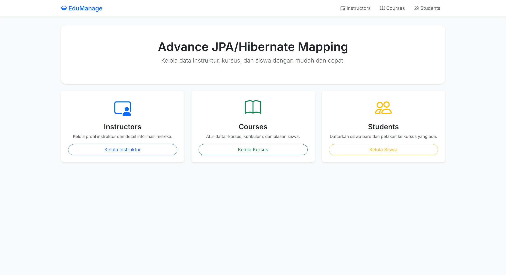

# 🎓 EduManage - Advanced JPA & Hibernate Mapping

[](https://spring.io/projects/spring-boot)
[](https://www.oracle.com/java/)
[](https://hibernate.org/)
[](LICENSE)

**EduManage** adalah platform demonstrasi sistem manajemen akademik yang dirancang untuk mengeksplorasi teknik pemetaan **Advanced JPA & Hibernate** yang kompleks. Proyek ini mengimplementasikan berbagai pola relasi database modern menggunakan **Java 25** dan **Spring Boot 4**.

---

## 📸 Project Showcase

### 🏠 Dashboard Utama
Tampilan antarmuka yang bersih dan intuitif untuk navigasi seluruh sistem.


<details>
<summary><b>🔍 Lihat Detail Showcase Lainnya</b></summary>

#### 👨‍🏫 Manajemen Instruktur
Sistem manajemen instruktur yang mengimplementasikan relasi `@OneToOne` dengan profil detail.
| Daftar Instruktur | Detail Instruktur |
| :---: | :---: |
|  |  |

#### 📚 Manajemen Kursus & Siswa
Implementasi relasi `@OneToMany` (Course to Review) dan `@ManyToMany` (Course to Student).
| Detail Kursus | Detail Siswa |
| :---: | :---: |
|  |  |

#### ➕ Formulir Input
UI yang responsif untuk menambahkan data baru ke dalam sistem.

</details>

---

## 🚀 Fitur Utama

- **Advanced Relationship Mapping:** Implementasi mendalam `@OneToOne`, `@OneToMany`, `@ManyToOne`, dan `@ManyToMany`.
- **Bidirectional Navigation:** Semua entitas mendukung navigasi dua arah yang dikelola dengan benar untuk konsistensi data.
- **Cascade Operations:** Penggunaan `CascadeType` yang tepat (Persist, Merge, Remove, dll.) untuk manajemen siklus hidup entitas.
- **Fetch Strategy Optimization:** Demonstrasi penggunaan `Eager` vs `Lazy` loading untuk performa maksimal.
- **Modern UI:** Dibangun dengan **Thymeleaf** dan **Bootstrap 5** dengan estetika *enterprise*.

---

## 🛠️ Tech Stack

- **Core:** Java 25 (Latest JDK Features)
- **Framework:** Spring Boot 4.0.6
- **Persistence:** Spring Data JPA / Hibernate ORM
- **Database:** MySQL 8.0+
- **Template Engine:** Thymeleaf
- **Styling:** Bootstrap 5 & Bootstrap Icons
- **Build Tool:** Maven

---

## 📊 Arsitektur Relasi JPA

Proyek ini mendemonstrasikan 4 jenis relasi utama:

1.  **`Instructor` ↔ `InstructorDetail` (`@OneToOne`)**
    - Berbagi siklus hidup melalui `CascadeType.ALL`.
2.  **`Instructor` → `Course` (`@OneToMany`)**
    - Satu instruktur dapat memiliki banyak kursus. Menggunakan *Lazy Loading*.
3.  **`Course` → `Review` (`@OneToMany`)**
    - Kursus dapat memiliki banyak ulasan dari siswa (Unidirectional & Bidirectional examples).
4.  **`Course` ↔ `Student` (`@ManyToMany`)**
    - Relasi kompleks di mana siswa dapat mengambil banyak kursus dan sebaliknya.

---

## ⚙️ Instalasi & Cara Menjalankan

### Persiapan
- JDK 25 installed
- MySQL Server running
- Maven installed

### Langkah-langkah
1. **Clone Repository**
   ```bash
   git clone https://github.com/rajuputra/edumanage-advanced-jpa.git
   ```

2. **Konfigurasi Database**
   Edit `src/main/resources/application.properties`:
   ```properties
   spring.datasource.url=jdbc:mysql://localhost:3306/hb_student_tracker?useSSL=false&serverTimezone=UTC
   spring.datasource.username=root
   spring.datasource.password=yourpassword
   ```

3. **Jalankan Aplikasi**
   ```bash
   mvn spring-boot:run
   ```
   Akses di: `http://localhost:8080`

---

## 👨‍💻 Penulis

**Raju Putra Dermawan**
*Software Engineer | Backend Developer*

[](https://www.linkedin.com/in/raju-putra-dermawan-244919220/)
[](https://github.com/rajuputra)

---
<p align="center">Dibuat dengan ❤️ untuk komunitas Java Indonesia</p>
